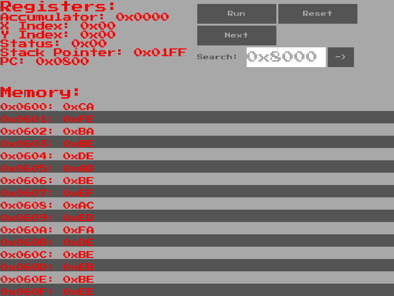

# 6502 Emulator

\
\
This emulator will assemble and run files written in 6502 assembly (check files in test_code for specific syntax)\
\
After compiling emulator executable, programs are run as follows:\
`./main path_to_assembly`\
\
**Packages Needed to Run GUI:**\
GLFW: sudo apt-get install libglfw3, sudo apt-get install libglfw3-dev\
GLAD: https://askubuntu.com/questions/1186517/which-package-to-install-to-get-header-file-glad-h\
CGLM: sudo apt-get install libcglm-dev\
FreeType: sudo apt-get install libfreetype-dev, sudo apt-get install libfreetype6\
\
**Assembler Directives Currently Supported:**\
.END: ignore all assembly after this directive\
.ORG $XXXX: load subsequent lines of code starting at address XXXX\
.WORD $HHLL: load word (LL \_then\* HH loaded)
